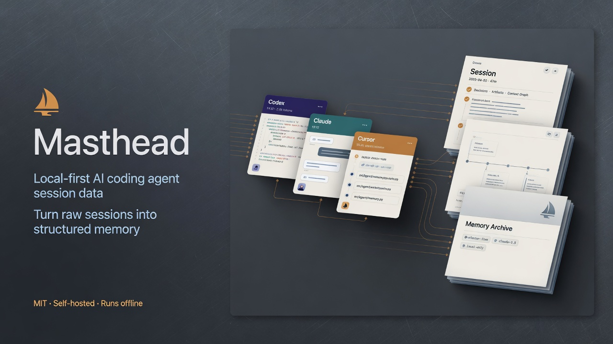
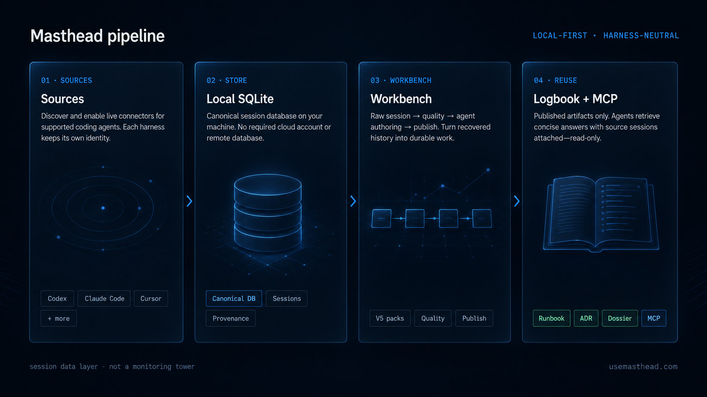

# Masthead



[](https://github.com/MayberryDT/Masthead/actions/workflows/ci.yml)
[](LICENSE)
[](https://usemasthead.com)
[](https://github.com/MayberryDT/Masthead/releases/latest)

**The work is still there. Masthead makes it findable.**

Masthead is a **local-first session data layer** for AI coding agents. It captures work from supported harnesses (Codex, Claude Code, Cursor, and others), keeps it in a canonical SQLite database on your machine, and turns selected sessions into **published knowledge artifacts**—dossiers, runbooks, ADRs, and incident timelines—that people and agents can search and reuse.

When a sidebar, index, or provider filter stops surfacing local history, Masthead gives supported sessions an independent place to live—and a path from raw transcript to reusable answer.

It is not a chat client, live monitoring tower, analytics dashboard, or task manager. Observability is a view over continuously collected session data.

## What Masthead does

- **Captures** supported agent sessions into one local record that outlives any single tool.
- **Connects** harnesses through Sources: discover, enable, activate, and test live connectors.
- **Publishes** durable work through Workbench: raw session → quality → agent authoring → publish.
- **Remembers** only what you publish in Logbook (artifacts, not a session library).
- **Retrieves** published knowledge via read-only MCP so the next agent can reuse answers with sources.



## Trust model

Masthead is built around a narrow, local-first boundary:

- **Local by design** — core use does not require a Masthead cloud account or remote database.
- **Your machine holds the record** — capture, storage, published knowledge, search, and retrieval audits stay on computers you control.
- **You choose what crosses** — only context you deliberately hand off goes to a coding-agent provider.
- **MCP is read-only** on the launch surface — other agents can query published knowledge; they do not write your store.
- **Harness files stay owned by their tools** — Masthead observes and records; it does not replace Codex, Claude Code, or Cursor.

More detail: [docs/OPEN_SOURCE.md](docs/OPEN_SOURCE.md) and [SECURITY.md](SECURITY.md).

## Product map

| Surface | Role |
| --- | --- |
| **Sources** | Discover and enable live harness connectors |
| **Workbench** | Raw session → quality → agent authoring → publish |
| **Logbook** | Published artifacts only (not a session library) |
| **MCP** | Read-only, artifact-primary tools for other agents |
| **Now** | Shallow live presence across supported harnesses |

## Install

### Desktop app (recommended)

Download the latest **macOS** or **Linux** build from:

**[GitHub Releases](https://github.com/MayberryDT/Masthead/releases/latest)**

| Platform | Artifact |
| --- | --- |
| macOS | `.dmg` (also zip) — **adhoc-signed** until Apple notarization lands |
| Linux | `.deb` and/or zip of the packaged app |

**macOS first open:** Gatekeeper may block adhoc-signed apps. If needed:

```bash
xattr -cr /Applications/Masthead.app
```

Or right-click the app → **Open**. Details: [docs/reference/macos-release-build.md](docs/reference/macos-release-build.md).

Windows desktop packaging is on the [roadmap](ROADMAP.md).

Website: [usemasthead.com](https://usemasthead.com) — product story and download path.

### Run from source

```bash
git clone https://github.com/MayberryDT/Masthead.git
cd Masthead
npm install
npm run dev
```

Requires **Node.js `>= 24.15.0`**.

`npm run dev` starts the local daemon (default `http://127.0.0.1:17373`) and the UI on the first free Vite port starting at `5173`. Open the URL printed in the terminal.

Desktop shell from a checkout:

```bash
npm run install:electron-dev-launcher   # once per checkout path
npm run dev:electron
```

Packaged build locally:

```bash
npm run build:electron
```

## First useful path

1. Install the desktop app (or `npm run dev`).
2. Open **Sources**, discover local harnesses, enable and test the ones you use.
3. Import history where offered (transcript import may require explicit approval—it can contain private work).
4. Use **Workbench** to select sessions and drive enrichment / V5 pack authoring with your coding agent.
5. Read published results in **Logbook**; attach **MCP** so another agent can retrieve artifacts with provenance.

Tutorials:

- [First run / Codex import](docs/tutorials/first-run-codex-import.md)
- [Import Codex history](docs/how-to/import-codex-history.md)
- [OpenWiki quickstart](docs/openwiki/quickstart.md)

## Status

**Pre-1.0** soft open source (`package.json` version is the source of truth; currently **0.1.15**).

- MIT licensed.
- APIs, schema, and UI can still change; treat this as early access for builders and dogfooders.
- Packaged desktop builds for **Linux and macOS** (macOS is adhoc-signed unless you supply your own Apple identity).

See [docs/OPEN_SOURCE.md](docs/OPEN_SOURCE.md).

## Project docs

**Public**

- [Roadmap](ROADMAP.md)
- [Contributing](CONTRIBUTING.md)
- [Security](SECURITY.md)
- [Support](SUPPORT.md)
- [Code of Conduct](CODE_OF_CONDUCT.md)
- [Changelog](CHANGELOG.md)
- [Open source expectations](docs/OPEN_SOURCE.md)
- [Architecture decisions](docs/adr/)
- [How-tos & tutorials](docs/how-to/) · [Tutorials](docs/tutorials/)
- [Reference](docs/reference/)

**For contributors & agents**

- [Product map (OpenWiki)](docs/openwiki/quickstart.md)
- [Design system](docs/internal/design.md)
- [Domain vocabulary](docs/internal/CONTEXT.md)
- [Agent instructions](docs/internal/AGENTS.md)

## License

Masthead is released under the [MIT License](LICENSE).
